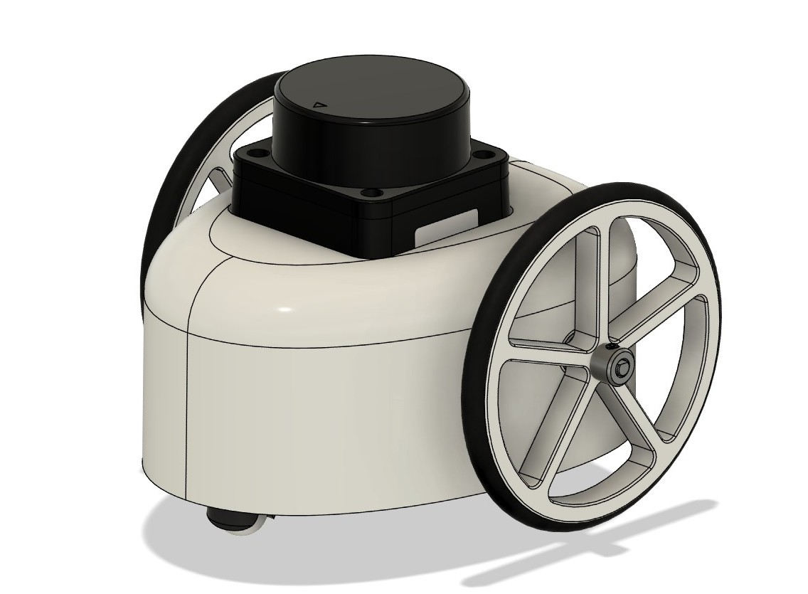
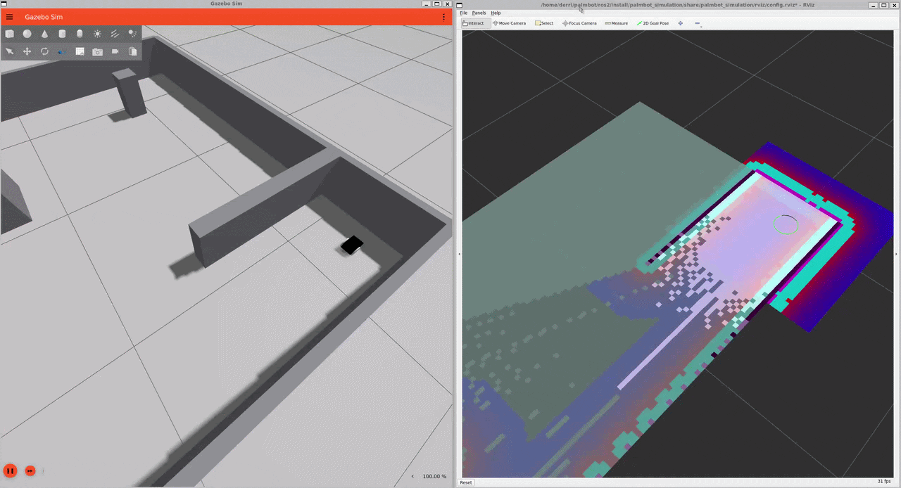

# Palmbot
[](https://github.com/dchoi98/palmbot/actions/workflows/ci.yaml)

Palmbot is a palm-sized differential-drive robot built on ROS 2, measuring 9.2 cm long, 9.6 cm wide, and 7.6 cm tall. The goal is a robot that maps a room with LiDAR, navigates on its own, and docks on a wireless charger when its battery runs low. Autonomous navigation works in simulation, and hardware is in progress.



## Project Status

| Phase | Description | Status |
| :---: | --- | :---: |
| 1 | CAD model and autonomous navigation in simulation | Done |
| 2 | Breadboard prototype, firmware, and PCB design | Next |
| 3 | Robot assembly and odometry evaluation | Planned |
| 4 | SLAM and navigation on hardware | Planned |
| 5 | Autonomous docking with wireless charging station | Planned |

<figure>
  
  <figcaption>Palmbot navigating autonomously in simulation. Gazebo is on the left, while RViz on the right shows the map and costmap.</figcaption>
</figure>

## Repository Layout
```
palmbot/
├── hardware/                 # Hardware design and manufacturing files
│   └── cad/                  # 3D CAD models for the robot chassis and mechanical components
├── images/                   # Documentation assets (renders, GIFs, diagrams)
└── ros2/                     # ROS 2 packages for simulation, description, and navigation
    ├── palmbot_description/  # Robot physical & visual description
    │   ├── launch/           # Launch files to spawn and visualize the robot
    │   └── urdf/             # URDF/Xacro files defining geometry, joints, and sensors
    ├── palmbot_navigation/   # Autonomous navigation & mapping stack
    │   ├── config/           # Nav2 parameters, costmaps, planners, and SLAM configs
    │   └── launch/           # Launch files to start navigation and mapping nodes
    └── palmbot_simulation/   # Gazebo simulation environment
        ├── config/           # Simulation-specific parameter overrides
        ├── launch/           # Launch files to initialize the Gazebo simulation
        ├── rviz/             # RViz configuration files for data visualization
        └── worlds/           # Gazebo world files (maps, obstacles, environment)
```

## Licensing
The contents of `hardware/` are licensed under CERN-OHL-S-2.0. This document and the contents of `docs/` are licensed under CC BY-SA 4.0. All other content in this repository is licensed under GPL-3.0-or-later.